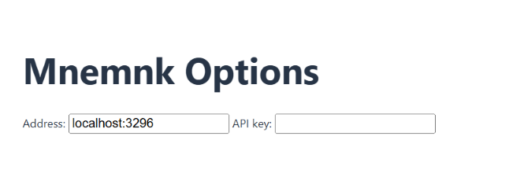

<div align="center">
  <a href="https://github.com/mnemnk/mnemnk-browser-extension">
    
  </a>

  <h3 align="center">Mnemnk Browser Extension</h3>

  <p align="center">
    Browser extension for Mnemnk to record your web browsing history.
  </p>
</div>

## Settings

1. Install [Mnemnk App](https://github.com/mnemnk/mnemnk-app) and [mnemnk-api](https://github.com/mnemnk/mnemnk-api) beforehand.

2. Open Mnemnk Settings, and copy `api_key`.

```json
    "api": {
      "enabled": true,
      "config": {
        "address": "localhost:3296",
        "api_key": "xxxxxxxxxxxxxxxxxxxxxxxxxxxxxxxxxxxxxxxxxxxx"
      }
    },
```

3. Open Options page of Mnemnk Browser Extension, and paste the API key.

<div align="center">
    
</div>

## License

[MIT](LICENSE) &copy; 2025 Akira Ishino
